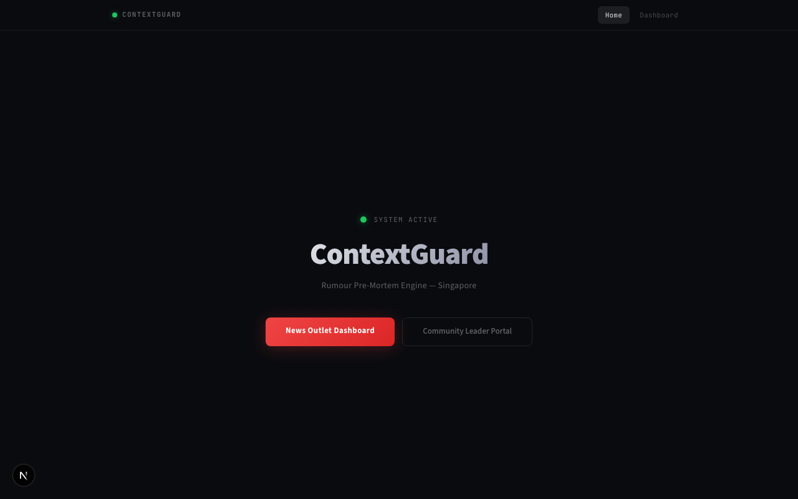
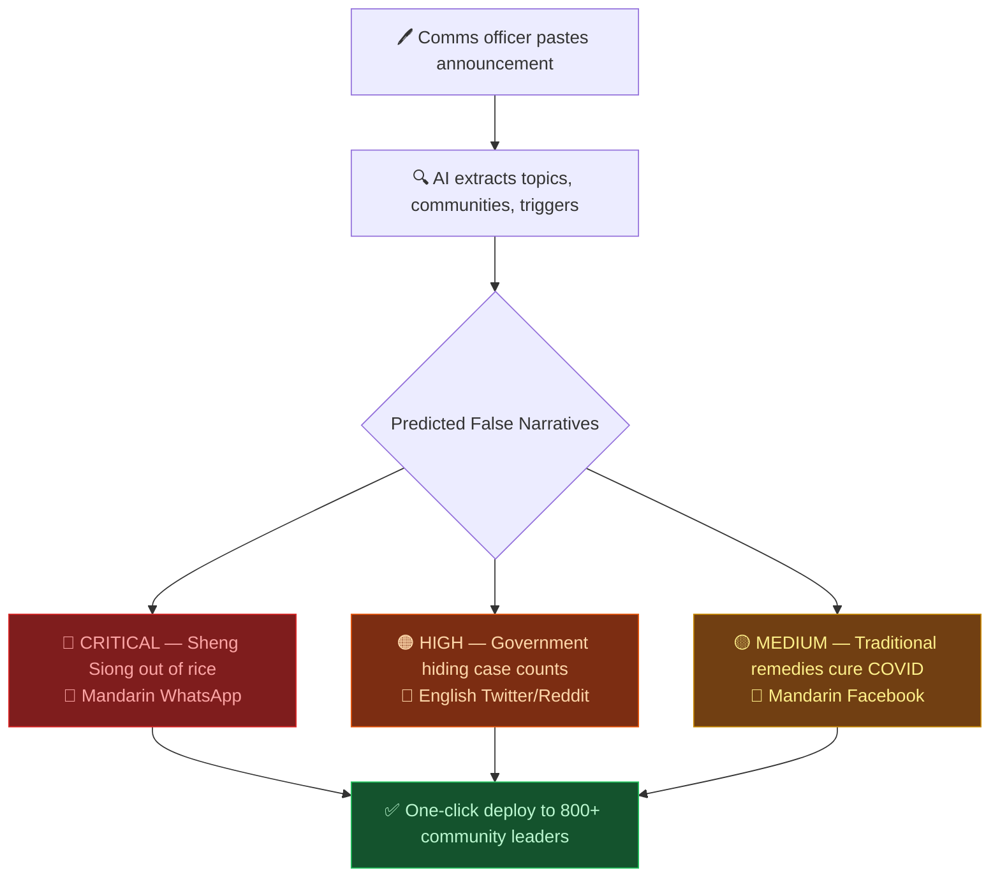
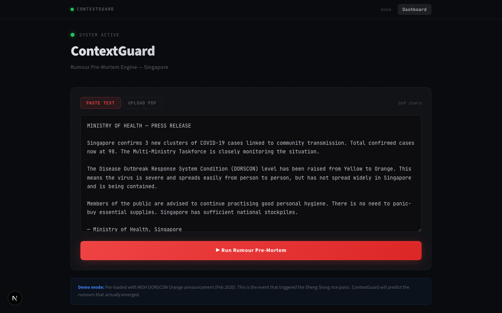
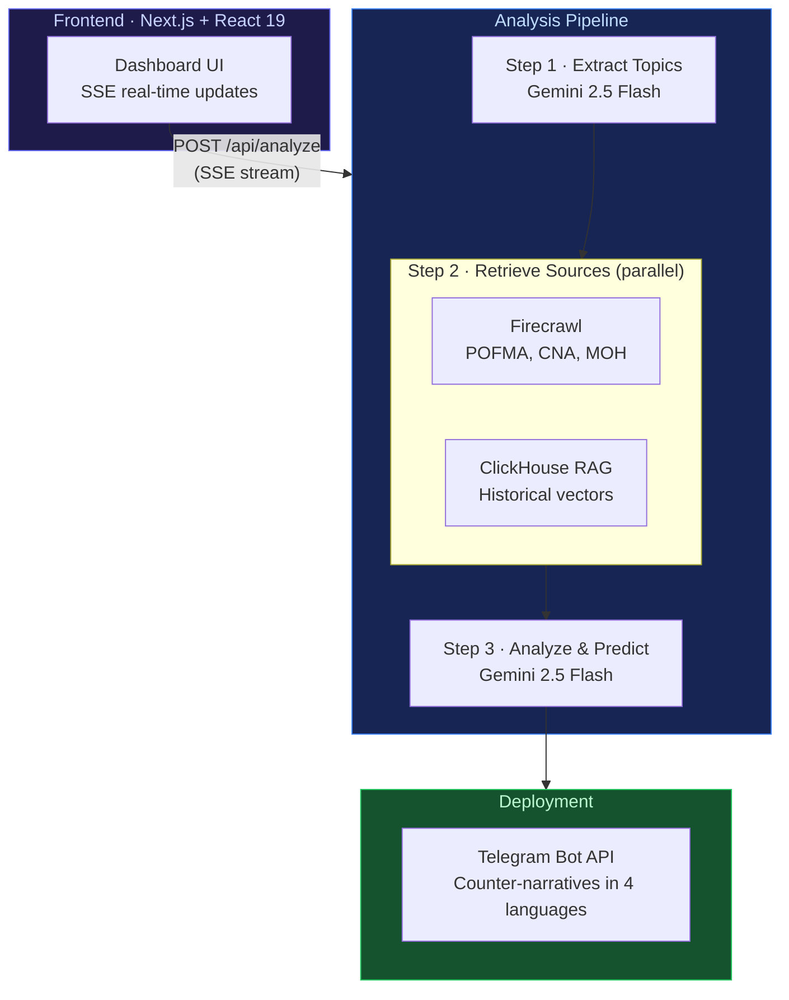
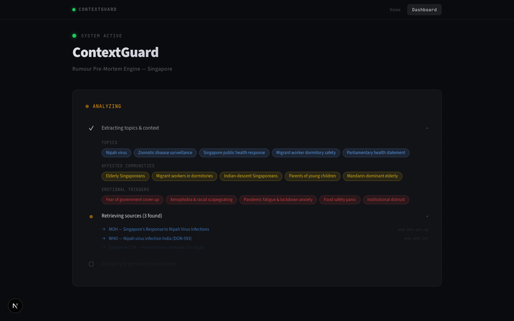
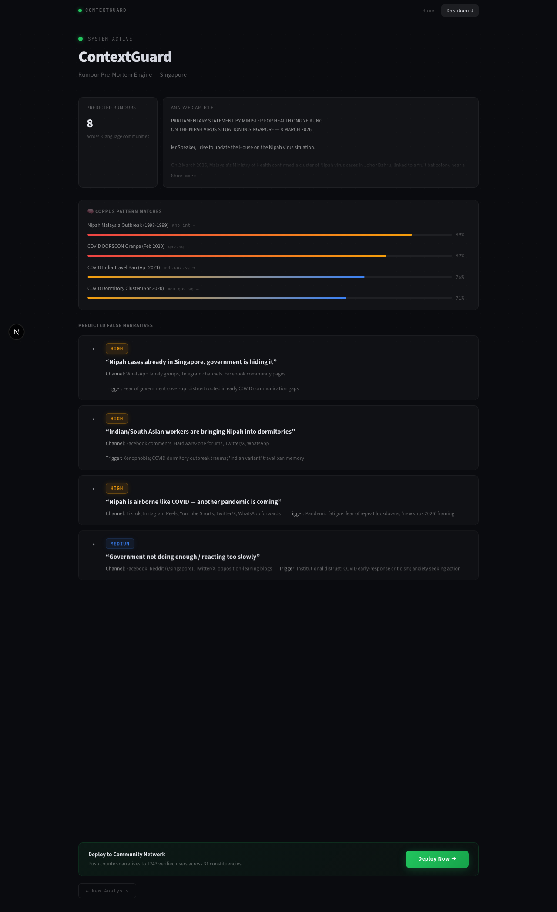
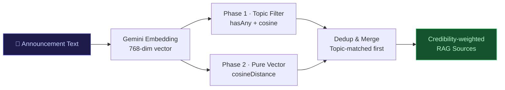
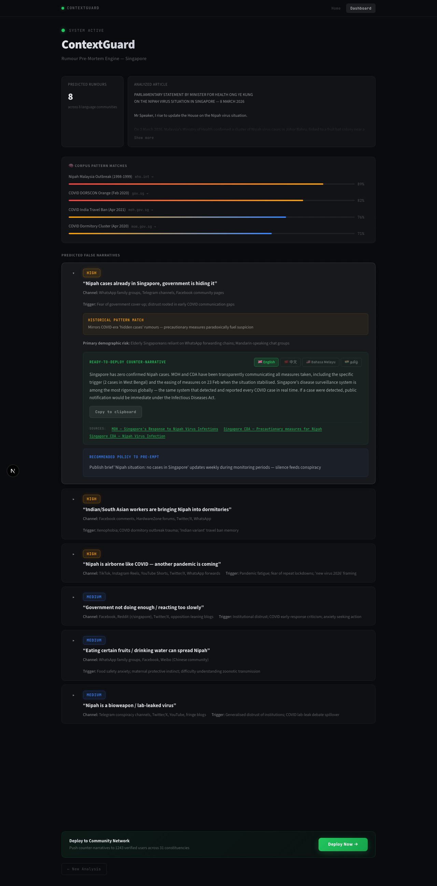

# ContextGuard

<p align="center">
    
  </a>
  <br/>
  <em>🏆 <a href="https://hackomania.geekshacking.com/" target="_blank">HackOMania Winner</a> ahrefs— ContextGuard</em>
</p>


### AI-Powered Rumour Pre-Mortem Engine for Singapore

> **HackOMania Problem Statement:** How might we design AI-powered solutions that help local and multilingual communities in Singapore assess information credibility, understand context, and make informed decisions — especially during times of uncertainty?

<p align="center">
  
</p>

---

## The Problem

Every existing solution — POFMA, CNA fact-checks, chatbots — is **reactive**. They correct misinformation *after* it has already spread.

> In February 2020, a rumour spread across WhatsApp that Sheng Siong had run out of rice. Within 6 hours, queues wrapped around every supermarket in Singapore. MOH issued a correction at 11pm — **8 hours too late**. 300,000 people had already panic-bought.

This pattern repeats every crisis: announcement → information vacuum → misinformation rushes in (in Mandarin, Malay, Tamil, via voice notes and dialects) → correction arrives too late → damage is done.

## Our Solution

ContextGuard is **proactive**. It predicts what misinformation will emerge *before* it spreads, and arms trusted community leaders with pre-written counter-narratives in all 4 official languages.



<p align="center">
  
</p>

---

## Why Singapore Misinformation Is Predictable

Singapore's misinformation follows patterns:
- The same **emotional triggers** (financial anxiety, racial tension, health fear)
- The same **language communities** targeted
- The same **gap** between official communication and public fear

We have a decade of POFMA notices, MOH corrections, and CNA fact-checks that prove this. The patterns are there — nobody has turned them into predictions. Until now.

---

## Tech Stack

| Layer | Technology | Purpose |
|-------|-----------|---------|
| **Frontend** | Next.js 16 (App Router) + React 19 | SSR, routing, API routes |
| **Styling** | Tailwind CSS 4 | Responsive dark-themed UI |
| **Language** | TypeScript 5 | End-to-end type safety |
| **LLM** | Google Gemini 2.5 Flash | Topic extraction, rumour prediction, counter-narrative generation |
| **Embeddings** | Gemini `embedding-001` | 768-dimensional text vectors for RAG |
| **Vector DB / RAG** | ClickHouse (MergeTree) | Hybrid topic + vector search over historical articles |
| **Web Scraping** | Firecrawl | Live source retrieval from POFMA, CNA, MOH |
| **Messaging** | Telegram Bot API | One-click counter-narrative deployment to community leaders |
| **PDF Support** | pdfjs-dist + react-pdf | Upload and parse PDF announcements |
| **Package Manager** | Bun | Fast dependency management |
| **Hosting** | Vercel | Serverless deployment |

---

## Architecture



---

## How It Works

### 1. Input
A comms officer pastes an official announcement (text or PDF) into the dashboard.

### 2. Topic Extraction
Gemini 2.5 Flash extracts **topics**, **affected communities**, **emotional triggers**, and **search queries** using structured JSON output. Results stream to the UI in real-time via SSE.

### 3. Source Retrieval (parallel)
Two retrieval paths run concurrently:
- **Firecrawl** scrapes live authoritative sources (pofmaoffice.gov.sg, channelnewsasia.com, moh.gov.sg) — up to 15 sources
- **ClickHouse RAG** performs hybrid search: topic-filtered vector search (Phase 1) + pure cosine similarity (Phase 2) over a corpus of embedded historical articles with credibility scores

<table>
<tr>
<td width="50%">

<p align="center"><em>Real-time processing with SSE streaming</em></p>
</td>
<td width="50%">

<p align="center"><em>Predicted false narratives ranked by risk</em></p>
</td>
</tr>
</table>

### 4. Rumour Prediction
All context — announcement, RAG sources (credibility-weighted), live sources, extracted topics — feeds into Gemini 2.5 Flash, which generates:
- **Historical pattern matches** with similarity scores
- **3-8 predicted false narratives** ranked by risk (CRITICAL/HIGH/MEDIUM/LOW), each with:
  - Likely spread channel (WhatsApp, Twitter, Telegram, etc.)
  - Emotional trigger and demographic risk
  - Pre-written counter-narratives in **English, Mandarin, Bahasa Melayu, and Tamil**
  - Policy recommendations and supporting sources

---

## RAG Implementation

ContextGuard uses a **hybrid RAG** approach combining topic filtering with vector similarity:



```sql
-- ClickHouse article_embeddings table
CREATE TABLE article_embeddings (
  id UUID,
  url String, title String, content String, domain String,
  topics Array(String),
  credibility_score Float32,    -- 0.95 gov | 0.90 media | 0.70 forums
  embedding Array(Float32)      -- 768-dim Gemini vectors
) ENGINE = MergeTree()
```

- **Phase 1**: Topic-filtered articles ranked by cosine distance (higher relevance)
- **Phase 2**: Pure vector search to fill remaining slots
- **Credibility weighting**: Government sources (0.95) prioritized for counter-narratives; forum posts (0.50-0.70) used to understand actual rumour language

The corpus includes POFMA correction orders, MOH advisories, CNA fact-checks, and community forum discussions — a Singapore-specific misinformation knowledge base that grows with every new crisis.

<p align="center">
  
  <br />
  <em>Expanded rumour card with counter-narratives in 4 languages</em>
</p>

---

## Two-Sided Platform

### Institutional Side (B2G)
PA, MOH, MOM, MAS, Town Councils — paste a draft announcement, get a rumour forecast, deploy counter-narratives proactively. **6-8 hour head start** on misinformation.

### Community Side (B2C)
RC Chairmen, mosque/temple/church administrators, grassroots leaders — receive pre-translated, pre-contextualised accurate information first. They become the trusted node in their network before WhatsApp does.

> We are not replacing community judgment. We are arming the people communities already trust, with the right information, at the right time, in the right language.

---

## Getting Started

### Prerequisites
- [Bun](https://bun.sh) runtime
- ClickHouse instance (local or cloud)

### Installation

```bash
# Clone the repository
git clone https://github.com/Kaleb-Nim/hackomania_contextguard.git
cd hackomania_contextguard

# Install dependencies
bun install
```

### Environment Variables

Create a `.env.local` file:

```env
GEMINI_API_KEY=your_gemini_api_key
CLICKHOUSE_HOST=http://localhost:8123
CLICKHOUSE_USER=default
CLICKHOUSE_PASSWORD=
CLICKHOUSE_DB=default
FIRECRAWL_API_KEY=your_firecrawl_api_key
TELEGRAM_BOT_TOKEN=your_telegram_bot_token
```

### Seed the RAG Database

```bash
bun run scripts/ingest.ts
```

### Run the Development Server

```bash
bun dev
```

Open [http://localhost:3000](http://localhost:3000) to access the dashboard.

---

## Project Structure

```
app/
├── page.tsx                       # Landing page
├── dashboard/page.tsx             # Main comms officer dashboard
├── api/
│   ├── analyze/route.ts           # Core SSE analysis endpoint
│   └── telegram/route.ts          # Telegram deployment endpoint

components/
├── AnnouncementInput.tsx          # Text/PDF input with file upload
├── ProcessingAnimation.tsx        # Real-time step visualization
├── RumourCard.tsx                 # Expandable prediction card
├── CounterNarrativeDisplay.tsx    # 4-language toggle display
├── ActionPanel.tsx                # Deploy confirmation modal
├── RiskBadge.tsx                  # Color-coded risk indicator
├── PatternBar.tsx                 # Historical similarity bar chart

lib/
├── types.ts                       # Core TypeScript interfaces
├── clickhouse.ts                  # ClickHouse client config
├── clickhouse/rag.ts              # Hybrid vector + topic search
├── scraper/search.ts              # Firecrawl + ClickHouse orchestration
├── ai/
│   ├── client.ts                  # Gemini API client
│   ├── extract-topics.ts          # Topic extraction
│   ├── analyze-and-predict.ts     # Rumour prediction engine
│   └── embedding.ts               # Gemini embedding generation

data/
├── demo-scenario.ts               # DORSCON Orange (COVID Feb 2020)
└── nipah-scenario.ts              # Nipah virus outbreak (Mar 2026)

scripts/
├── ingest.ts                      # Seed ClickHouse with articles
├── scrape-and-ingest.ts           # Scrape, embed, and ingest
└── scrape-historical.ts           # Historical event scraping
```

---

## Demo Scenarios

### DORSCON Orange (COVID-19, Feb 2020)
Predicts the actual misinformation that emerged: panic-buying rumours, government cover-up theories, racial scapegoating, and folk medicine claims — with counter-narratives in all 4 languages.

### Nipah Virus Outbreak (Mar 2026)
Demonstrates forward-looking prediction: hidden cases, dormitory targeting, airborne transmission myths, bioweapon conspiracy theories — 8 predictions ranked by virality risk.

---

## Key Technical Decisions

1. **Gemini 2.5 Flash** — Structured JSON output with schema enforcement + fast inference for real-time streaming
2. **ClickHouse over dedicated vector DB** — Native `cosineDistance()` on `Array(Float32)` with MergeTree engine; supports hybrid topic + vector queries without extra infrastructure
3. **SSE over WebSockets** — Simpler unidirectional streaming that works naturally with Next.js API routes
4. **Hybrid RAG** — Topic filtering + vector similarity improves precision for Singapore-specific patterns vs. pure embedding search
5. **Single-call multilingual generation** — All 4 language counter-narratives generated in one LLM call for consistency

---

*ContextGuard — predict the rumour. Close the window. Protect the community.*
